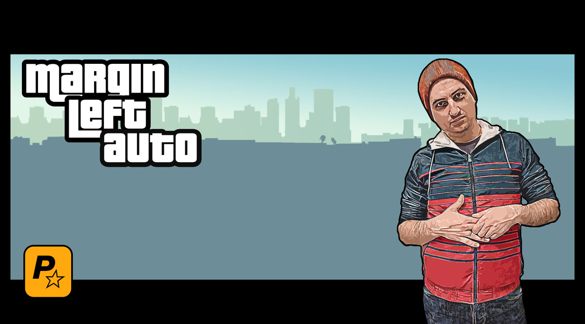

# 
Hi there , I am Dmytro Prokoptsov!

Hope you've had your coffee already. If not, I'll keep this short. I'm **HUSBAND**, **FATHER** and **in 3 years middle FRONTEND developer**, at least will do my best to reach this goal. Though I've just started my journey, I am deeply in love with all that magic JS, CSS and HTML can do. Also I fond of leanrnig some new stuff, so I listen to astronomical podcasts all the time, watch videos about software development on YouTube as well, read books when have some spare moments.

---
### 
My pint-sized TOOLBOX 🧰

    

---
### 
What I'm about to start learning :brain:

 

---
What else... well, I repair my car all the time! *Chinese vehicle* is real headache:upside_down_face:  And fill free to contact me, if you wanna leave a feedback or help me gain some experience.

How to reach me out:

---
## &#x1f4c8; My GitHub Stats
 

